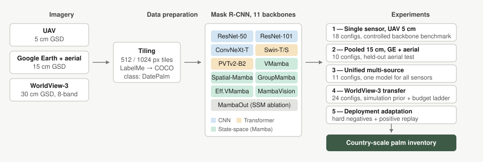

<div align="center">

# Date-palm instance segmentation across sensors and scales

**Mask R-CNN with ten interchangeable backbone architectures (CNN,
transformer and state-space) in eighteen size variants, benchmarked on
date-palm crown delineation from 5 cm UAV imagery to 30 cm satellite
imagery, and adapted into a country-scale palm inventory.**

[](https://github.com/brakuta/Datepalm-Instance-Segmentation/actions/workflows/validate.yml)
[](LICENSE)
[](docker/Dockerfile.reconstructed)
[](docker/Dockerfile.reconstructed)
[](https://github.com/open-mmlab/mmdetection)

[Quick start](#1-quick-start) ·
[Layout](#2-repository-layout) ·
[Installation](#3-installation) ·
[Data](#4-data-layout) ·
[Data preparation](#5-data-preparation) ·
[Training](#6-training) ·
[Evaluation](#7-evaluation) ·
[Inference](#8-inference-with-the-deployed-model)

</div>



The code is built on
[MMDetection](https://github.com/open-mmlab/mmdetection) 3.3.0, installed
as a package: this repository adds the project configs, backbone wrappers
and tooling, and vendors the MMDetection train/test entry points
unchanged. The imagery, annotations and trained checkpoints are not
distributed
([`WITHHELD.md`](WITHHELD.md) lists what is absent and why); everything
needed to rebuild the environment, prepare data in the expected format,
retrain every model and reproduce the evaluation is here.

## 1. Quick start

**Step 1. Clone and build the environment** (about an hour; kernel
compilation dominates):

```bash
git clone https://github.com/brakuta/Datepalm-Instance-Segmentation.git
cd Datepalm-Instance-Segmentation
docker build -f docker/Dockerfile.reconstructed -t mamba-mmdet:rebuilt .
```

**Step 2. Start the container** with your data and checkpoints mounted:

```bash
docker run --gpus all -it --shm-size=16g \
    -v /path/to/datasets:/workspace/datasets \
    -v /path/to/checkpoints:/workspace/Datepalm-Instance-Segmentation/checkpoints \
    -v /path/to/work_dirs:/workspace/Datepalm-Instance-Segmentation/work_dirs \
    mamba-mmdet:rebuilt
```

The image is built from your checkout, so edits made before the build
(section 4) are inside it. The third mount keeps training outputs when
the container is removed.

<details>
<summary>On Windows</summary>

Run steps 1 and 2 from PowerShell with Docker Desktop running; the
`docker` command is available there directly. Use Windows paths for
the host side of each mount and a backtick for line continuation:

```powershell
docker build -f docker/Dockerfile.reconstructed -t mamba-mmdet:rebuilt .
docker run --gpus all -it --shm-size=16g `
    -v C:\path\to\datasets:/workspace/datasets `
    -v C:\path\to\checkpoints:/workspace/Datepalm-Instance-Segmentation/checkpoints `
    -v C:\path\to\work_dirs:/workspace/Datepalm-Instance-Segmentation/work_dirs `
    mamba-mmdet:rebuilt
```

Everything from step 3 onwards runs inside the container and is the
same on every host. If Git is not installed, download the repository
as a ZIP from GitHub and unpack it; the build does not need the `.git`
directory.

</details>

**Step 3. Verify the installation** (inside the container; this needs
no data, so run it before anything else; two of the models download
their ImageNet weights from HuggingFace on first build, so it needs
network access):

```bash
python configs/Custom/utils/handover_selftest.py     # imports and versions
python configs/Custom/utils/smoke_build_models.py    # builds every model, one forward pass
```

**Step 4. Train and test a model.** This needs the datasets in place
(sections 4 and 5) and the pretrained backbone weights listed in
`weights.yaml`:

```bash
python tools/train.py configs/Custom/1_single_sensor_uav_5cm/maskrcnn_r50_uav5cm.py \
    --cfg-options default_hooks.checkpoint.save_best=coco/segm_mAP_50 \
                  custom_hooks.0.monitor=coco/segm_mAP_50

python tools/test.py configs/Custom/1_single_sensor_uav_5cm/maskrcnn_r50_uav5cm.py \
    work_dirs/maskrcnn_r50_uav5cm/best_coco_segm_mAP_50_iter_XXXX.pth
```

The `--cfg-options` line is needed for experiment 1 only: its configs
share a runtime whose checkpoint and early-stopping hooks monitor the
pooled-validation metric key, while the single-sensor evaluator reports
`coco/segm_mAP_50` (see section 6). Section 6 lists all 67 experiment
configs.

## 2. Repository layout

The five experiments, each in its own folder under `configs/Custom/` with
its own README:

| | folder | what it tests | imagery | configs |
|---|---|---|---|---|
| **1** | [`1_single_sensor_uav_5cm/`](configs/Custom/1_single_sensor_uav_5cm) | backbone benchmark on a fixed sensor | UAV, 5 cm | 18 |
| **2** | [`2_pooled_15cm_ge_aerial/`](configs/Custom/2_pooled_15cm_ge_aerial) | two 15 cm sources pooled | Google Earth + aerial | 10 |
| **3** | [`3_unified_multisource/`](configs/Custom/3_unified_multisource) | one model on all three sources | UAV + GE + aerial | 11 |
| **4** | [`4_satellite_wv3_30cm/`](configs/Custom/4_satellite_wv3_30cm) | satellite transfer from three initialisations, plus 8-band multispectral | WorldView-3, 30 cm | 24 |
| **5** | [`5_deployment_finetune/`](configs/Custom/5_deployment_finetune) | hard-negative adaptation of the deployed model | GE, 15 cm, national | 4 |

Supporting code:

| path | contents |
|---|---|
| [`configs/Custom/_base_palm/`](configs/Custom/_base_palm) | shared dataset, schedule, hook and sampler definitions, inherited by every experiment config |
| [`configs/Custom/utils/`](configs/Custom/utils) | dataset building, installation checks, inference helpers |
| [`configs/Custom/Evaluation/`](configs/Custom/Evaluation) | metrics engine, per-model evaluation, result compilation |
| [`configs/Custom/Feature_Analysis/`](configs/Custom/Feature_Analysis) | representation-level analysis (CKA, Bures fidelity, separability) |
| [`configs/Custom/Finetune_HN/`](configs/Custom/Finetune_HN) | hard-negative mining and threshold calibration |
| [`configs/Custom/tools_staged/`](configs/Custom/tools_staged) | experiment 4 tooling (budget manifests, stem inflation) |
| [`mmdet/models/backbones/`](mmdet/models/backbones) | backbone wrappers; contain no architecture code |
| [`palm_inference/`](palm_inference) | tiled, resumable, georeferenced inference pipeline |
| [`docker/`](docker) | `Dockerfile.reconstructed`, the environment recipe |
| [`tools/`](tools) | `train.py`, `test.py` (vendored from MMDetection), `install_backbones.py`, `validate_repo.py` |

Reference documents at the root:

| file | contents |
|---|---|
| [`weights.yaml`](weights.yaml) | every model weight by official source, with SHA256 where captured |
| [`THIRD_PARTY.md`](THIRD_PARTY.md) | upstream projects, pinned commits and licences |
| [`WITHHELD.md`](WITHHELD.md) | files deliberately not published, and why |
| [`requirements.txt`](requirements.txt) | pinned versions; read the ordering note inside |
| [`CONTRIBUTING.md`](CONTRIBUTING.md) · [`CITATION.cff`](CITATION.cff) · [`LICENSE`](LICENSE) | contributing, citation and licence |

<details>
<summary>Internal stage names used in the manuscript and historical documents</summary>

| folder | internal name |
|---|---|
| `1_single_sensor_uav_5cm` | `maskrcnn_palm` (Stage A) |
| `2_pooled_15cm_ge_aerial` | `maskrcnn_palm_ms15` (Stage B) |
| `3_unified_multisource` | `maskrcnn_palm_stagec` (Stage C) |
| `4_satellite_wv3_30cm` | `maskrcnn_palm_staged` (Stage D) |
| `5_deployment_finetune` | `maskrcnn_palm_finetune_hn` |

</details>

## 3. Installation

### 3.1 Requirements

| component | version |
|---|---|
| GPU | CUDA-capable, 24 GB VRAM used in this work (TITAN RTX, sm_75) |
| base image | `nvidia/cuda:12.1.0-cudnn8-devel-ubuntu22.04` |
| Python / PyTorch | 3.10.12 / 2.1.0+cu121 |
| mmengine / mmcv / mmdet / mmpretrain | 0.10.1 / 2.1.0 / 3.3.0 / 1.2.0 |
| mamba-ssm / causal-conv1d | 2.2.4 / 1.4.0 |

Three dependencies compile CUDA extensions against a specific torch/CUDA
pair: `mmcv 2.1.0` (source-only on PyPI), `mamba-ssm 2.2.4` and
`causal-conv1d 1.4.0`, plus the `selective_scan` and `dwconv2d` kernels
from the state-space model (SSM) projects themselves. A version mismatch fails at import, or
at the first GPU kernel launch.

### 3.2 Docker build (recommended)

```bash
docker build -f docker/Dockerfile.reconstructed -t mamba-mmdet:rebuilt .
```

[`docker/Dockerfile.reconstructed`](docker/Dockerfile.reconstructed) is
pinned to the exact commits used in this work and performs all of the
steps below in the right order, including cloning the upstream backbone
repositories to `/opt` and compiling their kernels. No GPU is needed
during the build: the kernels are compiled for every architecture in
`TORCH_CUDA_ARCH_LIST` (sm_75 to sm_90) and are checked on the GPU
afterwards by the two commands in section 3.4. The `docker run` command
with the expected mount points is documented at the end of the file and
in the quick start above.

Three upstream kernel sources need a small edit before they compile in
this environment. The Dockerfile applies each edit with `sed` at the step
where it is needed, explains it in a comment there, and stops the build
if the upstream file has changed so that an edit no longer lands. The
same edits are listed under manual installation below.

Keep a copy of a working image. The CUDA base image prints a deprecation
notice at start-up and NVIDIA schedules such tags for deletion, so once
the checks in section 3.4 pass, run `docker save mamba-mmdet:rebuilt -o
mamba-mmdet-rebuilt.tar` or push the image to a registry you control.

### 3.3 Manual installation

Follow this order. It matters, because mmcv compiles against whatever
torch it finds:

```bash
# 0. pins that every later pip call must respect. NumPy must stay below 2
#    (torch 2.1.0 cannot exchange tensors with NumPy 2, and nothing in the
#    package metadata says so); timm must stay at 1.0.15 (two upstream
#    requirements files pin 0.4.12, which MambaVision and MambaOut cannot use)
printf '%s\n' 'numpy<2' 'torch==2.1.0' 'torchvision==0.16.0' \
    'torchaudio==2.1.0' 'timm==1.0.15' 'mmengine==0.10.1' \
    'transformers==4.50.0' > pip-constraints.txt
export PIP_CONSTRAINT=$PWD/pip-constraints.txt

# 1. torch first, from the cu121 index
pip install torch==2.1.0 torchvision==0.16.0 \
    --index-url https://download.pytorch.org/whl/cu121

# 2. mmcv, built or fetched against the torch just installed (see note below),
#    then the rest of the OpenMMLab stack and pure-python dependencies
pip install mmcv==2.1.0 \
    -f https://download.openmmlab.com/mmcv/dist/cu121/torch2.1/index.html \
    || pip install --no-build-isolation mmcv==2.1.0
pip install -r requirements.txt

# 3. the SSM kernels, from git at a tag, against the installed torch
git clone https://github.com/Dao-AILab/causal-conv1d.git && cd causal-conv1d \
    && git checkout v1.4.0 && pip install --no-build-isolation . && cd ..
git clone https://github.com/state-spaces/mamba.git && cd mamba \
    && git checkout v2.2.4 && pip install --no-build-isolation . && cd ..
pip install mambavision

# 4. the upstream backbone repositories at their pinned commits
#    (paths are hard-coded in the wrappers; the directory names matter)
#    /opt/vmamba /opt/spatial_mamba /opt/groupmamba /opt/efficientvmamba
#    See THIRD_PARTY.md for each repository and commit, and
#    docker/Dockerfile.reconstructed for the kernel build commands.
#    Install Spatial-Mamba's and VSSD's requirements files without their
#    timm line, then apply the three edits in the table below and build
#    the kernels with --no-build-isolation.

# 5. copy the backbone wrappers into the installed mmdet package, and put
#    the repository root on PYTHONPATH (the configs import their shared
#    hooks as configs.Custom._base_palm.*)
python tools/install_backbones.py
export PYTHONPATH=$PWD:$PYTHONPATH
```

The three upstream edits in step 4, each applied by the Dockerfile with
the reason in a comment beside it:

| file | edit | why |
|---|---|---|
| `/opt/vmamba/kernels/selective_scan/setup.py` | disable the compute-capability query and drop the `-arch=sm_XX` flag | the query needs a GPU, and the flag makes torch ignore `TORCH_CUDA_ARCH_LIST` |
| same file | `MODES = ["core", "oflex"]` instead of `["oflex"]` | GroupMamba calls the `core` variant directly |
| `/opt/spatial_mamba/kernels/dwconv2d/depthwise_fwd/launch.cu` | add `#include <ATen/core/grad_mode.h>` after the ATen include | `at::NoGradGuard` is no longer reachable through `ATen/ATen.h` in torch 2.1 |

Two notes on this sequence. mmcv must be able to see torch while it is
installed: recent pip versions build every package in an isolated
environment where torch is absent, and mmcv then installs *without* its
CUDA ops and fails later at `from mmcv.ops import ...`. The command in
step 2 takes OpenMMLab's prebuilt wheel for this torch/CUDA pair and
falls back to a source build that can see the installed torch. Step 5 is
required as well: the configs import the wrappers as
`mmdet.models.backbones.*`, so the wrapper files must sit inside the
installed mmdet package, and they import shared hooks as
`configs.Custom._base_palm.*`, which needs the repository root on
`PYTHONPATH`. The Docker build performs both automatically.

`tools/train.py` and `tools/test.py` are vendored unchanged from
MMDetection 3.3.0, so training commands run from the repository root
without a separate MMDetection checkout.

### 3.4 Verifying the installation

```bash
python configs/Custom/utils/handover_selftest.py     # imports, versions, GPU visibility
python configs/Custom/utils/smoke_build_models.py    # builds each model, one forward pass
```

Run both inside the container, started with `--gpus all`. The first
checks the imports, the versions, GPU visibility, and that every
compiled kernel a backbone wrapper needs is present; it should end with
`Everything passed`. The second builds every experiment 3 model, without
pretrained weights, and pushes a tensor through each backbone; it should
end with `11 of 11 model(s) built and ran`. That second step is the one
that catches a kernel compiled for the wrong GPU architecture. If you see
`no kernel image is available for execution on the device`, rebuild the
kernels with a wider `TORCH_CUDA_ARCH_LIST` (the Dockerfile sets
`7.5;8.0;8.6;8.9;9.0+PTX`). MambaVision fetches its model code and
configuration from HuggingFace the first time it is built, so that run
needs network access once.

### 3.5 Pretrained backbone weights

Training starts from ImageNet checkpoints. [`weights.yaml`](weights.yaml)
records every file: its official source, its SHA256 where captured, and
whether it is an unchanged upstream file or one derived locally (for
example, classifier heads stripped, or a 3-channel stem widened to 8
bands). Derived files can be regenerated with
`configs/Custom/utils/strip_backbone_checkpoint.py` and
`configs/Custom/tools_staged/inflate_stem_to_nband.py`. Several files
were renamed during the work, so match them by hash rather than filename.
MambaVision and MambaOut weights are fetched from HuggingFace when the
model is first built and need network access at that moment.

## 4. Data layout

All datasets are COCO-format instance segmentation sets with a single
class, `DatePalm`, one folder per sensor under a common root:

| dataset | source | GSD (ground sample distance) | tiles | used by experiment |
|---|---|---|---|---|
| `UAV_5cm/` | UAV orthomosaics | 5 cm | 1024 × 1024 | 1, 3 |
| `GE_15cm/` | Google Earth | 15 cm | 1024 × 1024 | 2, 3, 5 |
| `Aerial_15cm/` | aerial survey | 15 cm | 1024 × 1024 | 2, 3 |
| `Sat_30cm/` | WorldView-3 | 30 cm | 512 × 512 | 4 |
| `GE_30sim/` | GE 15 cm, degraded to simulate 30 cm | 30 cm | 512 × 512 | 4 (pre-training) |

Each sensor folder contains one directory per split, holding the tiles
under `JPEGImages/` (the COCO file names include that prefix), and an
`Annotations/` directory with the matching COCO JSON. The original work
kept everything under `/workspace/datasets/COCO/`; either mount your data
there or edit `data_root` in the dataset configs and keep
`configs/Custom/Evaluation/sensor_registry.py` consistent with it. The
experiment 3 dataset file is the one exception: it names the same trees
under `/root/datasets/COCO/`, and the Docker image links that path to
`/workspace/datasets` so one mount serves both.

<details>
<summary>Full directory tree with the exact split and annotation names</summary>

```
<COCO root>/
  UAV_5cm/
    train_UAV/  val_UAV/  test_UAV/
    Annotations/train_UAV.json  val_UAV.json  test_UAV.json
  GE_15cm/
    train_GE/  val_GE/  test_GE/
    Annotations/train_GE.json  val_GE.json  test_GE.json
  Aerial_15cm/
    train_aerial/  val_aerial/  test_aerial/
    Annotations/train_aerial.json  val_aerial.json  test_aerial.json
  Sat_30cm/
    train_sat/  val_sat/  test_sat/
    Annotations/train_sat.json  val_sat.json  test_sat.json
  GE_30sim/
    GE_30sim_train/  GE_30sim_val/  GE_30sim_test/
    Annotations/GE_30sim_train.json  GE_30sim_val.json  GE_30sim_test.json
```

</details>

Each dataset config header in `configs/Custom/_base_palm/` states the
tile counts and provenance of its corpus. Before training, check three
paths in your copies of the configs:

1. `data_root` in the dataset files;
2. `pretrained=` in the per-backbone configs, pointing at the ImageNet
   weights from `weights.yaml`;
3. `work_dir`, where runs write, and `load_from` in the experiment 4 and
   5 configs, which name the experiment 3 checkpoints they start from.
   Experiments 1 and 2 write to relative `./work_dirs/`; the others ship
   with the original machine's absolute paths.

## 5. Data preparation

The tiling pipeline is documented in
[`configs/Custom/utils/TILING_README.md`](configs/Custom/utils/TILING_README.md)
and runs in two steps:

1. Orthomosaic plus reference polygons in, image tiles plus
   [LabelMe](https://github.com/wkentaro/labelme) JSON out
   (`image_vector_to_labelme_pipeline.py`). One job file per corpus
   (`jobs_example.json` is a template); band selection and the minimum
   crown size are derived from each mosaic's ground sample distance
   (GSD), while the tile size and overlap are fixed settings.
2. LabelMe to COCO conversion (`labelme2coco_palm.py`), which writes
   the split directories and annotation files in the layout of
   section 4 and a `tiling_log.json` with the counts to report.

The shipped pipeline is the version rebuilt for the WorldView-3 corpus
(experiment 4) and defaults to 512 px tiles with 50% training overlap.
The UAV, Google Earth and aerial corpora of experiments 1 to 3 were built
with an earlier version at 1024 px; to reproduce that layout pass
`--set TILE_SIZE=1024 --set OVERLAP_FRACTION=0.25` (the document
explains the `--set` mechanism).

Three dataset-construction policies affect results and are explained in
that document: empty (palm-free) tiles are allowed in training sets only,
never in validation or test; background tiles are capped at 30% of a
training set with a fixed seed; and `filter_empty_gt=True` in a config
drops empty tiles without any message, so the image count in the
training log is the place to notice it.

For experiment 4, `configs/Custom/tools_staged/` holds the extra
preparation steps: building the simulated 30 cm pre-training corpus,
nested annotation-budget manifests (`build_budget_manifests.py`), and
widening pretrained stems for the 8-band multispectral runs
(`inflate_stem_to_nband.py`).

## 6. Training

Each experiment folder holds one config per backbone. Ten architectures
are compared, most in two sizes:

| family | backbones |
|---|---|
| CNN | ResNet (50, 101), ConvNeXt-T |
| Transformer | Swin (T, S), PVTv2-B2 |
| State-space (SSM, Mamba family) | VMamba, Spatial-Mamba, GroupMamba, EfficientVMamba, MambaVision |
| Control | MambaOut, the ablation with the state-space component removed |

Training is always:

```bash
python tools/train.py <config> [--work-dir <dir>]
```

### Experiment 1: single-sensor benchmark, UAV 5 cm (18 configs)

The controlled backbone comparison: same data, same schedule, same
detector, only the backbone changes. Both size variants of most families.

```
maskrcnn_{r50,r101,swin_t,swin_s,convnext_t,pvtv2_b2}_uav5cm.py
maskrcnn_{vmamba,spatialmamba,groupmamba,mambaout,mambavision}_{t,s}_uav5cm.py
maskrcnn_efficientvmamba_{s,b}_uav5cm.py      # EfficientVMamba sizes are S and B
```

These configs share a runtime whose checkpoint and early-stopping hooks
monitor the pooled-validation key `GE_val/coco/segm_mAP_50`, while the
single-sensor evaluator reports `coco/segm_mAP_50`. Pass
`--cfg-options default_hooks.checkpoint.save_best=coco/segm_mAP_50
custom_hooks.0.monitor=coco/segm_mAP_50` when training them, as in the
quick start.

### Experiment 2: pooled 15 cm, Google Earth + aerial (10 configs)

Trains on both 15 cm sources together and validates on Google Earth only.
The aerial test split is held out and scored afterwards with
`configs/Custom/Evaluation/evaluate_model.py --sensors Aerial`, so the
pooling question is not answered by the validation set that selected the
checkpoints.

### Experiment 3: unified multi-source model (11 configs)

UAV 5 cm, Google Earth 15 cm and aerial 15 cm pooled into one training
set, with source-local batch construction (each batch is drawn from one
source). The deployed model comes from this comparison.

### Experiment 4: WorldView-3 30 cm transfer (24 configs)

Four config families, named by suffix:

| suffix | purpose |
|---|---|
| `_ge30sim_stage1` | pre-training on simulated 30 cm imagery (GE 15 cm downsampled with point-spread-function blur and sensor noise), the prior for one arm below |
| `_staged_full` | full training on real WorldView-3; run from ImageNet weights, from the experiment 3 checkpoint, or from the simulated-30 cm checkpoint, so the three runs differ only in initialisation |
| `_staged_ft` | fine-tuning on real WorldView-3 from the experiment 3 checkpoint with the early backbone stages frozen |
| `_staged_ms` | 8-band multispectral WorldView-3 instead of RGB |

`tools_staged/run_staged_matrix.sh` drives the matrix and injects the
starting checkpoint for each arm. Read
[`STAGE_D_README.md`](configs/Custom/4_satellite_wv3_30cm/STAGE_D_README.md)
in that folder before running these; it records how the design evolved,
including which arms were dropped from the reported study. The
annotation-budget manifests built by
`tools_staged/build_budget_manifests.py` are available tooling for a
labelling-cost study; they are consumed by overriding a config's
training annotation file.

### Experiment 5: deployment and hard-negative adaptation (4 configs)

Adapts the experiment 3 model against the false positives found in
country-scale operation (palm-like shrubs, ghaf, acacia), with the
original positive data replayed alongside the negatives so recall is
preserved. `maskrcnn_spatialmamba_s_deploy.py` is the deployed
configuration. This is an operational adaptation; the benchmark
checkpoints and their reported numbers are unaffected. Supporting tools
(hard-negative tile mining, threshold recalibration, false-positive
evaluation) are in `configs/Custom/Finetune_HN/`.

Two practical notes that apply across experiments. Experiments 2 to 5
fix `randomness.seed = 0` in their shared runtimes; experiment 1 leaves
the seed unset, so each of its runs draws one and records it only in its
own log (pass `--cfg-options randomness.seed=0` to fix it). Training
budgets differ between experiments; check the schedule a config inherits
before comparing numbers across them.

## 7. Evaluation

Per-model evaluation and table compilation live in
[`configs/Custom/Evaluation/`](configs/Custom/Evaluation/), with their
own README. The usual sequence:

```bash
# score one trained model on the sensors it applies to
python configs/Custom/Evaluation/evaluate_model.py \
    --config <config> --checkpoint <ckpt> --sensors UAV GE Aerial

# compile per-experiment tables from the run logs
python configs/Custom/Evaluation/compile_results.py --results-dir <dir>

# cross-sensor transfer matrix
python configs/Custom/Evaluation/build_manifest.py ...
python configs/Custom/Evaluation/run_cross_transfer.py --manifest <manifest>
python configs/Custom/Evaluation/compile_cross_transfer.py --manifest <manifest>
```

`sensor_registry.py` in that folder is the single source of truth for
sensor names, annotation paths and evaluation protocols; keep it
consistent with your `data_root`. The `--work-root` and work-directory
arguments of the compilers must point at wherever your runs wrote (the
README examples use a `work_dirs/Stage_<X>/` layout; the configs write
where their `work_dir` says). The Evaluation README also lists what
to check before comparing numbers across experiments (training budgets,
the MambaOut control, the detection cap).

## 8. Inference with the deployed model

`palm_inference/` is a tiled, resumable, georeferenced inference
pipeline: it tiles large GeoTIFFs, runs batched FP16 inference, merges
and de-duplicates detections across tile boundaries, and writes
GeoPackage. An interrupted run resumes from its manifest.

```bash
python -m palm_inference.run_inference \
  --input-root /path/to/geotiffs \
  --output-root /path/to/output \
  --config-file configs/Custom/5_deployment_finetune/maskrcnn_spatialmamba_s_deploy.py \
  --checkpoint /path/to/checkpoint.pth \
  --tile-size 1024 --overlap 256 \
  --score-thr 0.30 --postprocess
```

Three settings to check before trusting an output map:

1. The tiling and threshold flags default to the deployment settings
   (1024 / 256 / 0.30); they are written out above so the values are
   visible. Changing any of them produces a different map.
2. Tile seams within one image are always resolved; `--postprocess`
   merges and de-duplicates across neighbouring input images. Without
   it, palms in the overlap between two mosaics are counted twice.
3. The model was trained at roughly 15 cm/px. At 1 m/px a crown is a few
   pixels across and will not be detected, whatever the other settings.

## 9. Repository checks

CI runs on every push, needs no GPU or torch, and finishes in seconds.
The same check runs locally:

```bash
python tools/validate_repo.py
```

It verifies that every config's `_base_` chain resolves, that paths named
in documentation, shell scripts and docstrings exist, that
`custom_imports` modules are published, that no private absolute paths or
data artefacts have been committed, and that markdown links are intact.
Run it before opening a pull request; `CONTRIBUTING.md` has the rest.

## 10. Citation and licence

Until the manuscript is published, please cite this repository (see
`CITATION.cff`), along with MMDetection and the upstream backbone
projects listed in [`THIRD_PARTY.md`](THIRD_PARTY.md):

```bibtex
@article{mmdetection,
  title   = {{MMDetection}: Open MMLab Detection Toolbox and Benchmark},
  author  = {Chen, Kai and Wang, Jiaqi and Pang, Jiangmiao and others},
  journal = {arXiv preprint arXiv:1906.07155},
  year    = {2019}
}
```

The repository is Apache-2.0, inherited from MMDetection
([`LICENSE`](LICENSE)). Upstream backbones carry their own terms; note in
particular that MambaVision is released by NVIDIA under a non-commercial
licence, which applies to MambaVision only. Wrappers in
`mmdet/models/backbones/` adapt the upstream implementations, which are
expected as clones under `/opt/`; `THIRD_PARTY.md` records each repository
and the exact commit used.
